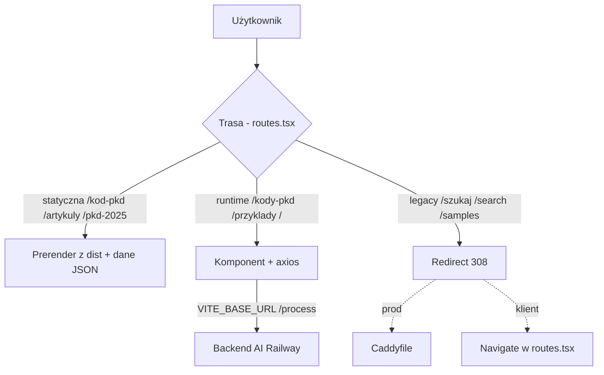

# Architektura — pkd-search

> Statycznie prerenderowana aplikacja React (SSG przez `vite-react-ssg`) z
> cienką warstwą runtime, która woła zewnętrzny backend AI. Brak własnej bazy:
> dane to JSON-y generowane w czasie buildu.

## Niezmienniki (trzymaj w głowie)

1. **Treść statyczna jest prerenderowana w buildzie.** Strona, która ma istnieć w prod, musi mieć ścieżkę w `getStaticPaths` (`routes.tsx`) i nie może być odfiltrowana w `vite.config.ts:ssgOptions.includedRoutes`.
2. **Dane to artefakty buildu.** `codes.json`, sitemapy powstają w `prebuild`. Źródło prawdy danych = `scripts/` + `popular-queries.json`, nie wygenerowane pliki.
3. **Runtime = tylko 3 strony.** Wyszukiwarka, Home, Samples wołają `VITE_BASE_URL`; reszta jest czysto statyczna.
4. **`VITE_BASE_URL` jest inline'owany w buildzie**, nie czytany w runtime.

## Przepływ żądania

## Tabela diagnostyczna

| Objaw | Sprawdź w kolejności |
|---|---|
| Strona 404 w prod, działa w dev | 1) `getStaticPaths` w `routes.tsx` 2) filtr `includedRoutes` w `vite.config.ts` 3) czy `prebuild` dał dane |
| Wyszukiwarka/Samples puste | 1) `VITE_BASE_URL` ustawiony przy buildzie 2) backend AI żyje 3) `axios`/`AbortController` w `Search.tsx` |
| Redirect legacy nie działa | 1) `Caddyfile:36-53` (prod) 2) `vercel.json` 3) `routes.tsx:104-111` (klient) — wszystkie trzy! |
| Złe meta/OG | 1) `<Head>` w komponencie 2) `seo.ts` 3) OG-image w prod jest statyczny |

## Które configi są autorytatywne?
- **Prod**: `Dockerfile` + `Caddyfile` (Railway, `kodypkd.app`). `vercel.json` = zapasowy/legacy.
- **Build**: `vite.config.ts` (`ssgOptions`) + `package.json:prebuild`.

## Related
[[moc-codebase]] · [[infrastructure]] · [[frontend]] · [[known-issues]] · [[adr-001-ssg-vite-react-ssg]]
