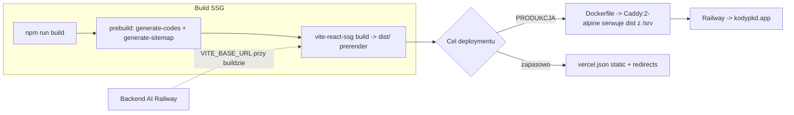

# Playbook: deploy

> Dwa cele deploymentu współistnieją w repo. **Produkcja = Caddy na Railway**
> (Docker). `vercel.json` to konfiguracja zapasowa/legacy dla Vercela.

## Topologia

## Steps

| # | Krok | Gdzie prawda |
|---|---|---|
| 1 | Ustaw `VITE_BASE_URL` jako Build Variable na Railway | `Dockerfile` (ARG/ENV) |
| 2 | Build obrazu: stage 1 `node:22-alpine` → `npm run build`, stage 2 `caddy:2-alpine` | `Dockerfile` |
| 3 | Caddy serwuje `dist` jako `/srv`, mapuje extensionless URL → `.html` | `Caddyfile:55-64` |
| 4 | (opcjonalnie) ping IndexNow po deployu | `INDEXNOW_KEY=<k> tsx scripts/ping-indexnow.ts` |

## What people ACTUALLY forget (project-specific)

1. **Redirecty legacy są zdublowane w `Caddyfile` (prod) i `vercel.json`** — zmiana w jednym wymaga zmiany w drugim oraz w `routes.tsx` (klient). Patrz [[adr-003-zdublowane-redirecty]].
2. **`@vercel/og` (`api/og.tsx`) jest martwe w prod** — Caddy serwuje statycznie, funkcja serverless nigdy się nie odpala; `og:image` wskazuje na `public/og-default.png` (`seo.ts:20-23`). Regeneracja karty: `npm run build:og`.
3. **Polityka cache Caddy**: hashowane `/assets/*` = immutable 1 rok; reszta (HTML, sitemapy) = `no-store` (`Caddyfile:24-30`). Łatwo pomylić z `vercel.json`, gdzie reszta nie ma `no-store`.
4. **Canonical host**: `www` → apex 308 jest w `Caddyfile:11-13` — Vercel tego nie robi.

## Related
[[infrastructure]] · [[adr-002-caddy-railway-zamiast-vercel]] · [[adr-003-zdublowane-redirecty]] · [[module-scripts]]
